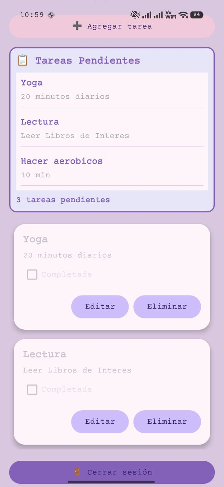
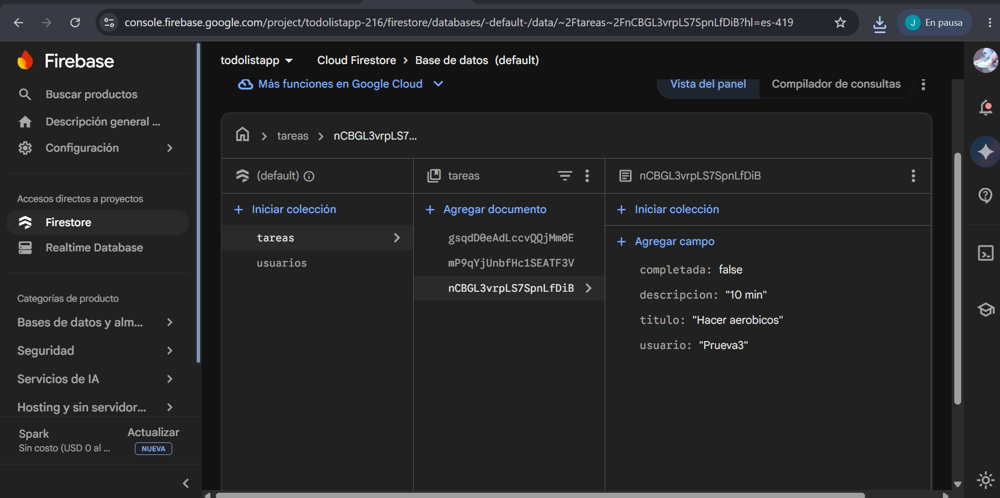
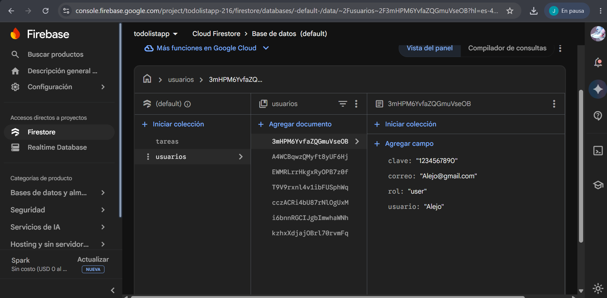

# Todo List App 📝

Una aplicación Android nativa para gestionar tareas diarias con sincronización en tiempo real usando Firebase Firestore y sistema de autenticación de usuarios con roles diferenciados.

## 📸 Capturas de Pantalla

| Inicio de Sesion | Registro | Roll Admin | Roll User | Tareas | Base Tareas | Base Usuarios |
|------------------|----------|------------|-----------|--------|-------------|---------------|
|  |  |  |  |  |  |  |

*Agregar capturas de pantalla en la carpeta `screenshots/`*

## 🚀 Características

- 🔐 **Sistema de Autenticación**: Login y registro de usuarios
- 👥 **Sistema de Roles**: Admin, User y Viewer con permisos diferenciados
- ✅ **CRUD Completo**: Crear, leer, actualizar y eliminar tareas
- 🔥 **Firebase Firestore**: Base de datos en la nube con sincronización en tiempo real
- 🎨 **Material Design**: Interfaz moderna con colores pastel
- 📱 **Doble RecyclerView**: Lista de tareas y panel de tareas pendientes
- ⚡ **Actualización en Tiempo Real**: Los cambios se reflejan instantáneamente
- ✏️ **Validación de Campos**: Validación de título (mínimo 3 caracteres), clave (10 dígitos) y correo electrónico
- 📊 **Panel de Información**: Muestra nombre de usuario, rol y contador de tareas pendientes
- 🚪 **Cerrar Sesión**: Funcionalidad para salir de la aplicación

## 🛠️ Tecnologías Utilizadas

| Tecnología | Versión |
|------------|---------|
| Lenguaje | Java |
| Min SDK | 24 (Android 7.0) |
| Target SDK | 36 |
| Compile SDK | 36 |
| Firebase Firestore | Latest |
| RecyclerView | 1.3.2 |
| CardView | 1.0.0 |
| Material Components | Latest |

## 📦 Estructura del Proyecto

```
app/
├── src/main/java/com/example/todolistapp/
│   ├── LoginActivity.java         # Actividad de inicio de sesión
│   ├── RegistroActivity.java      # Actividad de registro de usuarios
│   ├── MainActivity.java          # Actividad principal (tareas)
│   ├── Tarea.java                 # Modelo de datos
│   ├── TareaAdapter.java          # Adapter para RecyclerView
│   └── AdminSQLiteOpenHelper.java # Helper para SQLite (opcional)
│
├── src/main/res/layout/
│   ├── activity_login.xml         # Layout de inicio de sesión
│   ├── activity_registro.xml      # Layout de registro
│   ├── activity_main.xml          # Layout principal (tareas)
│   ├── item_tarea.xml             # Item individual de tarea
│   └── dialog_tarea.xml           # Diálogo para crear/editar
│
└── src/main/res/values/
    ├── colors.xml                 # Paleta de colores pastel
    ├── strings.xml                # Recursos de texto
    └── themes.xml                 # Temas de la app
```

## 🎨 Componentes Desarrollados

### 1. **LoginActivity.java** - Inicio de Sesión
- Interfaz con título llamativo "BIENVENIDOS A TODOLISTAPP"
- Panel de login con campos Usuario y Clave
- **Spinner de Roles**: Selector de rol (admin, user, viewer) para el login
- Botón "INGRESAR" para validar credenciales contra Firestore
- Botón "REGISTRAR" para navegar a registro de usuarios
- Validación contra colección "usuarios" en Firestore
- Mensajes Toast para feedback de autenticación
- Redirección a MainActivity pasando nombre de usuario y rol

### 2. **RegistroActivity.java** - Registro de Usuarios
- Formulario completo con validaciones:
  - Nombre de usuario (requerido)
  - Correo electrónico (validación de formato con Patterns.EMAIL_ADDRESS)
  - Clave de exactamente 10 dígitos
  - Confirmación de clave (debe coincidir)
- **Spinner de Roles**: Selector limitado a "user" y "viewer" para nuevos registros
- Botón "REGISTRAR" que guarda en Firestore con todos los datos incluyendo rol
- Mensaje de éxito: "¡Registro de usuario exitoso!"
- Limpieza automática de campos tras registro exitoso
- Redirección automática a LoginActivity tras registro exitoso

### 3. **MainActivity.java** - Gestión de Tareas
- Inicializa **doble RecyclerView**: tareas completas y panel de pendientes
- Configura listener en tiempo real de Firebase Firestore
- Muestra diálogo para agregar nuevas tareas
- Valida campos antes de guardar (título mínimo 3 caracteres, descripción requerida)
- Gestiona el ciclo de vida (onDestroy limpia listeners)
- **Sistema de Roles Implementado**:
  - **Admin**: Ve todas las tareas, puede editar y eliminar cualquier tarea, puede crear tareas
  - **User**: Ve solo sus propias tareas, puede eliminar solo las no completadas, puede crear tareas
  - **Viewer**: Ve todas las tareas pendientes (solo lectura), no puede crear, editar ni eliminar
- **Botón "Cerrar sesión"**: Permite al usuario salir de la aplicación y regresar al login
- **Panel de Información**: Muestra nombre de usuario, rol actual y contador de tareas pendientes
- Control de visibilidad del botón "Agregar tarea" según el rol

### 4. **Tarea.java** - Modelo de Datos
- Modelo de datos con propiedades:
  - `id`: Identificador único del documento
  - `titulo`: Título de la tarea
  - `descripcion`: Descripción detallada
  - `completada`: Estado de completado (boolean)
  - `usuario`: Nombre del usuario creador de la tarea (para filtrado por roles)

### 5. **Rol.java** - Enumeración de Roles
- Enum con los tres roles del sistema: ADMIN, USER, VIEWER
- Método `fromString()` para conversión desde String
- Valor por defecto: USER

### 6. **TareaAdapter.java** - Adapter para Lista Principal
- Extiende `RecyclerView.Adapter`
- Muestra lista de tareas en tarjetas (CardView)
- Botones de acción por cada tarea con lógica de permisos:
  - **Editar**: Visible solo para Admin, abre diálogo con datos prellenados
  - **Eliminar**: Visible para Admin o User (solo si es su tarea y no está completada)
- CheckBox para visualizar estado de completado
- Control de visibilidad de botones según rol y propietario de la tarea

### 7. **PendientesAdapter.java** - Adapter para Panel de Pendientes
- Extiende `RecyclerView.Adapter`
- Muestra lista simplificada de tareas pendientes en tarjetas
- Solo muestra título y descripción (sin botones de acción)
- Usado para el panel informativo de tareas pendientes

### 8. **AdminSQLiteOpenHelper.java**
- Clase helper para base de datos local SQLite
- Crea tabla `tareas` con columnas: id, titulo, descripcion, estado
- *Nota: Actualmente no está integrada en la lógica principal*

### 9. **Layouts**
- **activity_login.xml**: 
  - Título "BIENVENIDOS A TODOLISTAPP" destacado
  - CardView con campos Usuario y Clave
  - **Spinner de selección de rol**
  - Botón INGRESAR (rosa pastel)
  - Botón REGISTRAR (menta pastel) debajo del panel
  
- **activity_registro.xml**:
  - Título "REGISTRO DE USUARIO"
  - Campos: Nombre de usuario, Correo, Clave (10 dígitos), Confirmar clave
  - **Spinner de selección de rol** (limitado a user y viewer)
  - Contador visible para longitud de clave
  - Botón REGISTRAR
  
- **activity_main.xml**: 
  - **TextView para nombre de usuario** (`tvNombreUsuario`)
  - **TextView para rol** (`tvRolUsuario`)
  - **Panel de tareas pendientes** con RecyclerView (`recyclerPendientes`)
  - **TextView informativo** con contador de pendientes (`tvTareasPendientesInfo`)
  - Botón "Cerrar sesión" en la parte superior
  - Botón "Agregar tarea"
  - RecyclerView principal para listar tareas (`recyclerTareas`)
  
- **item_tarea.xml**: CardView con título, descripción, checkbox y botones de editar/eliminar
- **item_pendiente.xml**: CardView simplificado para el panel de pendientes (solo título y descripción)
- **dialog_tarea.xml**: Formulario con TextInputLayout para título y descripción

### 10. **Recursos Visuales**
- Paleta de colores pastel en `colors.xml`:
  - Rosa Pastel (`#F8C8DC`)
  - Lila Pastel (`#DCC6E0`)
  - Menta Pastel (`#C7EDE6`)
  - Azul Pastel (`#AEC6CF`)
  - Morado (`#8B5FBF`)
  - Gris Texto (`#555555`)

## 🔥 Configuración de Firebase

1. Crea un proyecto en [Firebase Console](https://console.firebase.google.com/)
2. Registra tu app Android con el package name: `com.example.todolistapp`
3. Descarga el archivo `google-services.json` y colócalo en `app/`
4. Habilita Firestore Database en modo prueba o configura reglas de seguridad
5. Se crearán automáticamente dos colecciones:
   - `usuarios`: Almacena credenciales de usuarios registrados
   - `tareas`: Almacena las tareas de los usuarios

## 📋 Requisitos Previos

- Android Studio Arctic Fox o superior
- JDK 11 o superior
- Cuenta de Google para Firebase
- Dispositivo/emulador con API 24+

## 🚀 Cómo Ejecutar

1. Clona el repositorio
2. Abre el proyecto en Android Studio
3. Agrega tu archivo `google-services.json` en la carpeta `app/`
4. Sincroniza el proyecto con Gradle
5. Ejecuta en un dispositivo o emulador

```bash
# Opcional: Build desde terminal
./gradlew assembleDebug
```

## 📱 Flujo de la Aplicación

1. **Pantalla de Login**: 
   - El usuario ve "BIENVENIDOS A TODOLISTAPP"
   - Selecciona su rol en el spinner (admin, user, viewer)
   - Ingresa usuario y clave para acceder
   
2. **Registro** (opcional):
   - Clic en botón "REGISTRAR"
   - Completa formulario con nombre, correo y clave de 10 dígitos
   - Selecciona rol (limitado a "user" o "viewer")
   - Confirma clave y presiona "REGISTRAR"
   - Recibe mensaje de éxito y es redirigido al login

3. **Gestión de Tareas**:
   - La pantalla principal muestra:
     - Nombre del usuario y rol actual
     - Panel informativo con contador de tareas pendientes
     - Lista completa de tareas (según permisos del rol)
     - Panel separado con tareas pendientes
   - Botón "Cerrar sesión" para salir y regresar al login
   - Botón "Agregar tarea" (visible solo para admin y user)
   - Agregar nuevas tareas con título y descripción
   - Editar tareas existentes (solo admin)
   - Eliminar tareas (admin siempre, user solo las propias no completadas)
   - Marcar tareas como completadas

## 🔮 Mejoras Futuras

- [ ] Implementar base de datos local SQLite con Room
- [ ] Modo offline con sincronización automática
- [ ] Recuperación de contraseña con Firebase Auth
- [ ] Categorías/Etiquetas para tareas
- [ ] Fechas de vencimiento
- [ ] Notificaciones push
- [ ] Modo oscuro
- [ ] Búsqueda y filtrado avanzado
- [ ] Asignar tareas a otros usuarios (para admin)
- [ ] Historial de tareas completadas

## 📄 Licencia

Este proyecto es de código abierto y está disponible bajo la licencia MIT.

## 👨‍💻 Autor

Desarrollado como proyecto de práctica con Android + Firebase.

---

**Estado del Proyecto**: ✅ Funcional - Sistema completo implementado con las siguientes características:

### ✅ Funcionalidades Completadas
- **Autenticación**: Login y registro de usuarios con validaciones
- **Sistema de Roles**: 3 roles implementados (Admin, User, Viewer) con permisos diferenciados
- **CRUD de Tareas**: Crear, leer, actualizar y eliminar tareas en Firestore
- **Tiempo Real**: Sincronización automática con Firebase Firestore
- **Doble Vista**: Lista principal + panel de tareas pendientes
- **Interfaz Moderna**: Material Design con paleta de colores pastel
- **Validaciones**: Campos obligatorios, email válido, clave de 10 dígitos, título mínimo 3 caracteres
- **Cerrar Sesión**: Funcionalidad completa para logout
- **Información de Usuario**: Visualización de nombre y rol en pantalla principal
- **Contador de Pendientes**: Panel informativo actualizado en tiempo real

### 📁 Estructura de Archivos Java
- `LoginActivity.java` - Gestión de inicio de sesión con selector de roles
- `RegistroActivity.java` - Registro de nuevos usuarios con asignación de rol
- `MainActivity.java` - Pantalla principal con doble RecyclerView y sistema de roles
- `Tarea.java` - Modelo de datos con campo de usuario
- `Rol.java` - Enumeración de roles del sistema
- `TareaAdapter.java` - Adapter para lista principal con control de permisos
- `PendientesAdapter.java` - Adapter para panel de tareas pendientes
- `AdminSQLiteOpenHelper.java` - Helper SQLite (no integrado actualmente)

### 🎨 Layouts Disponibles
- `activity_login.xml` - Login con spinner de roles
- `activity_registro.xml` - Formulario de registro con spinner de roles
- `activity_main.xml` - Pantalla principal con panel de información y doble RecyclerView
- `item_tarea.xml` - Item de tarea con botones de acción
- `item_pendiente.xml` - Item simplificado para panel de pendientes
- `dialog_tarea.xml` - Diálogo para crear/editar tareas
